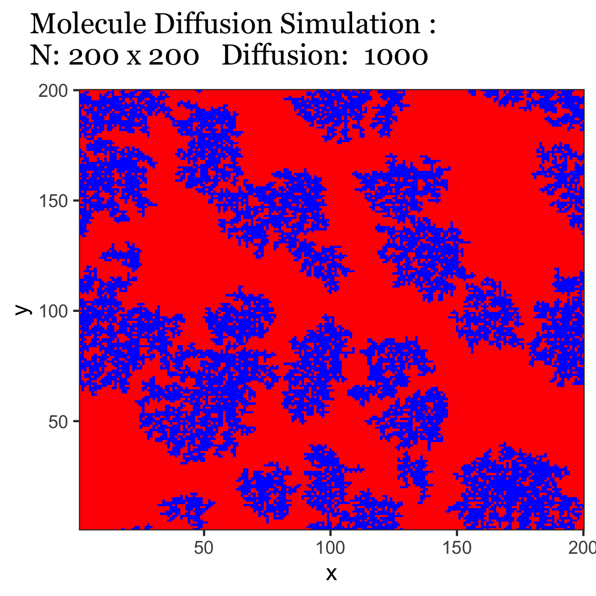
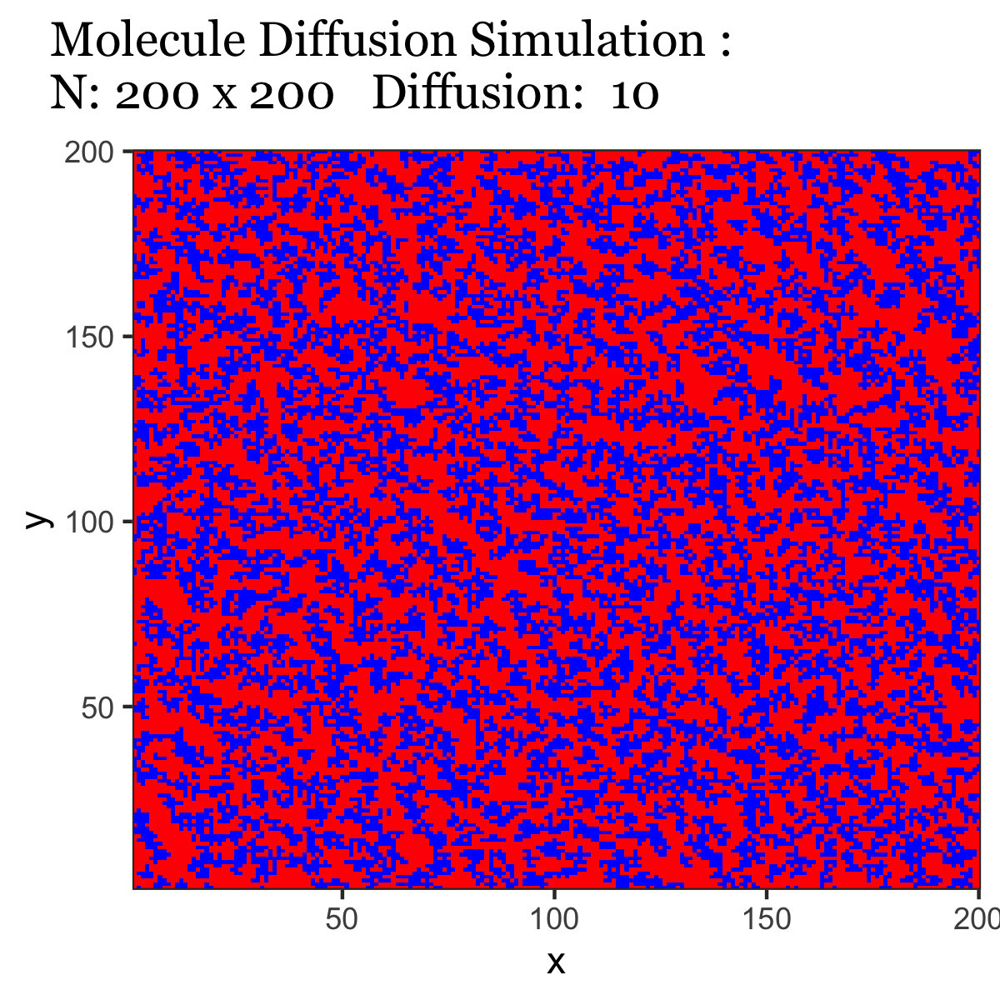
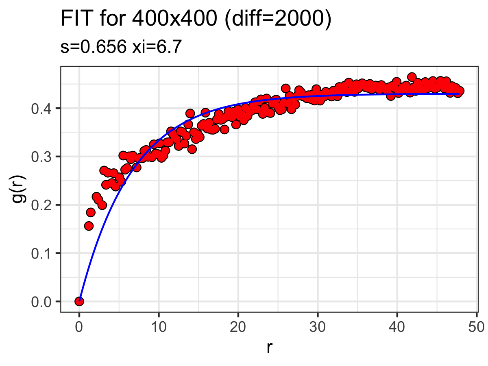
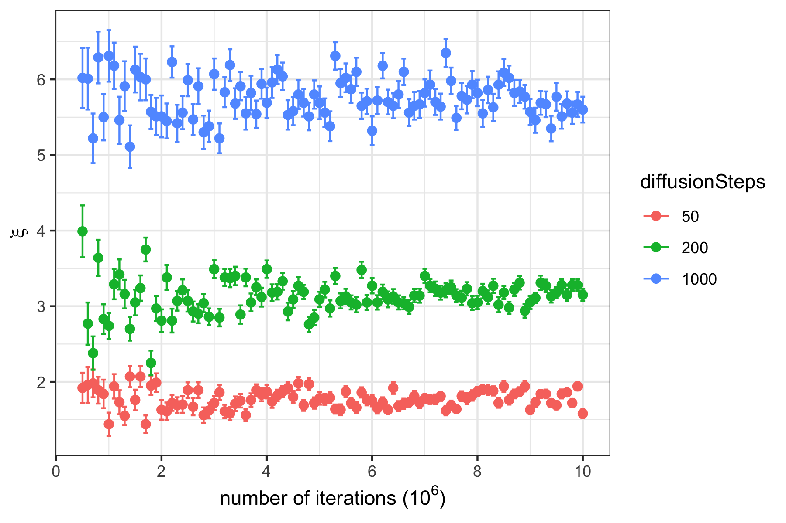

# MonteCarlo-DiffusionGrowth
 Molecular Thin Film Growth by Diffusion using Monte Carlo

## Model

An empty slate is populated with dot molecules that can move up / down or (model b) sideways randomly for Tdifussion steps. More diffusion will create larger clusters as expected. 

## Simulation Images

Here are two images generated for a 200x200 cluster size with diffusion 10 and 1000, respectively:

## Measuring the height-height correlation length

We have discussed the merits of [height-height correlation function to determine grain size](https://iopscience.iop.org/article/10.1088/1742-6596/417/1/012069/pdf), so we are applying this method to these images.

In order to limit the correlation length fit standard deviation to about 3%, at least 5 million iterations for the HHCF are needed for a 400x400 grid, see `test.hhcf.R`. The correlation length dependence with iterations for 3 different diffusion lengths are shown here:

## Grain Size Dependence on Diffusion Steps

